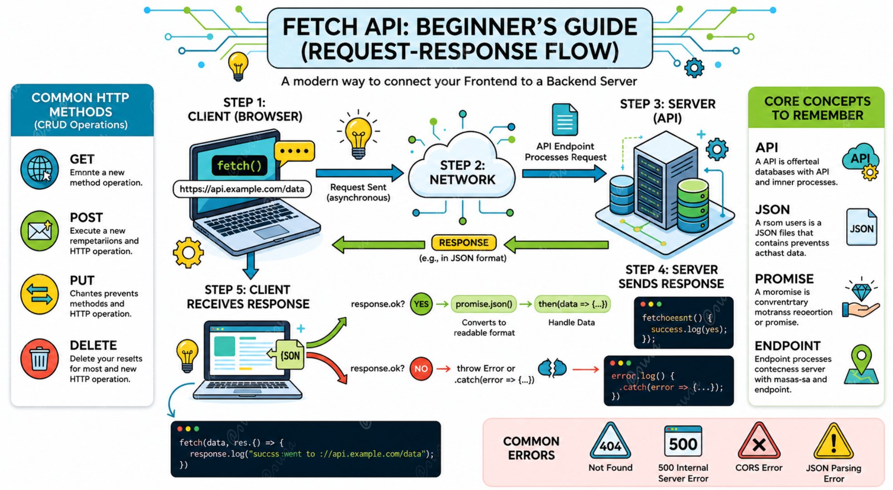

# Fetch API Documentation (Basic Beginner Friendly Guide)
The Fetch API provides a modern, versatile interface for accessing and manipulating parts of the HTTP pipeline, such as requests and responses. It is the successor to the older ```XMLHttpRequest.```

## 1. What is the Fetch API?

At its core, the Fetch API is a built-in JavaScript tool for communicating with servers. It allows you to perform CRUD (Create, Read, Update, Delete) operations by connecting your frontend application to a backend server or a third-party API.

Key Capabilities:
- ```GET```: Retrieve data from a server.
- ```POST```: Send new data to a server.
- ```PUT/PATCH```: Update existing data.
- ```DELETE```: Remove data from a server.

## 2. Basic Architecture

The Fetch process follows a simple Request-Response flow:

- Client (Browser) sends request using fetch()
- Server (API) processes the request
- Server sends Response
- Data is returned in JSON format

<p align="center">
  
</p>

## 3. Standard Syntax (Promises)
The basic fetch() method takes one mandatory argument: the URL of the resource you want to fetch. It returns a Promise.
```
fetch("https://api.example.com/data")
  .then(response => {
    if (!response.ok) {
      throw new Error("Network response was not ok");
    }
    return response.json(); // Converts response to JSON
  })
  .then(data => {
    console.log("Success:", data); // Handle the data
  })
  .catch(error => {
    console.error("Fetch Error:", error); // Handle errors
  });
```

## 4. HTTP Methods in Action
### A. GET Request (Retrieve Data)
Used to fetch information. This is the default method for fetch().
```
fetch("https://jsonplaceholder.typicode.com/posts/1")
  .then(response => response.json())
  .then(json => console.log(json));
```
### B. POST Request (Send Data)
Used to create new resources. You must specify the method, headers, and body.
```
fetch("https://jsonplaceholder.typicode.com/posts", {
  method: "POST",
  headers: {
    "Content-type": "application/json; charset=UTF-8"
  },
  body: JSON.stringify({
    title: "New Post",
    body: "Content of the post",
    userId: 1
  })
})
  .then(response => response.json())
  .then(data => console.log("Created:", data));
```
###C. PUT Request (Update Data)
Used to update an existing resource entirely.
```
fetch("https://jsonplaceholder.typicode.com/posts/1", {
  method: "PUT",
  headers: {
    "Content-type": "application/json"
  },
  body: JSON.stringify({
    id: 1,
    title: "Updated Title",
    body: "Updated Content"
  })
})
  .then(response => response.json())
  .then(data => console.log("Updated:", data));
```
---

## 5. Modern Approach: Async / Await
Using async/await makes your code look synchronous, cleaner, and much easier to read compared to nested .then() blocks.
```
async function fetchPosts() {
  try {
    const response = await fetch("https://jsonplaceholder.typicode.com/posts");
    
    if (!response.ok) {
      throw new Error(`HTTP error! status: ${response.status}`);
    }

    const data = await response.json();
    console.log("Fetched Data:", data);
  } catch (error) {
    console.error("Could not fetch data:", error);
  }
}

fetchPosts();
```
## Core Concepts to Remember!
| Concept | Description |
| :--- | :--- |
| **API** | The bridge (Interface) that lets two software talk to each other. |
| **JSON** | A lightweight format for storing and transporting data (JavaScript Object Notation). |
| **Promise** | An object representing the eventual completion (or failure) of an async operation. |
| **Endpoint** | The specific URL where the API can be accessed. |

## 7. Troubleshooting Common Errors

- ```404 Not Found```: The URL/Endpoint is incorrect.
- ```500 Internal Server Error```: Something went wrong on the server's side.
- ```CORS Error```: The server is blocking requests from your domain for security.
- ```JSON Parsing Error```: Occurs if you try to run .json() on a response that isn't valid JSON.
